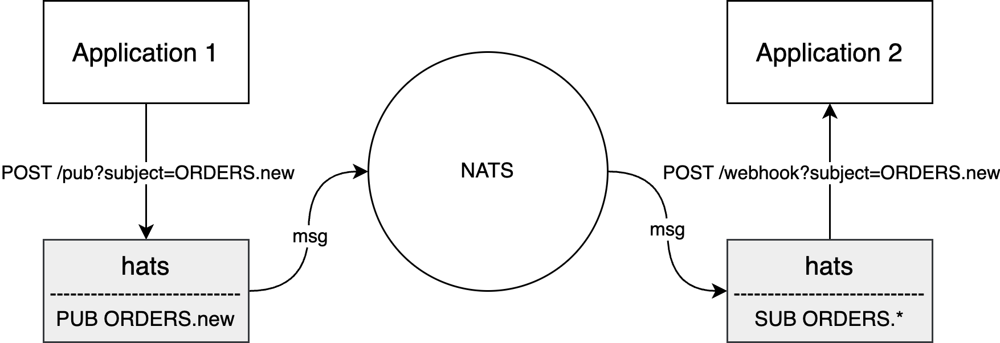

# hats

[][1]

Communicating with NATS using the HTTP protocol.

<p align="center">

</p>


## Installation

```bash
go install github.com/RussellLuo/hats@latest
```

<details open>
  <summary> Usage </summary>

```bash
$ hats -h
Usage of hats:
  -config string
    	YAML/JSON file to read configuration from
  -nats string
    	The URL of the NATS server (default "nats://127.0.0.1:4222")
  -pub_addr string
    	The listen address of the publishing server (default ":8080")
  -pub_key string
    	The auth key for the endpoints of the publishing server
  -sub_stream -sub_stream
    	The JSON config of a single stream (Set multiple -sub_stream for multiple streams)
  -sub_webhook_key string
    	The auth key of the default webhook
  -sub_webhook_url string
    	The URL of the default webhook (default "http://127.0.0.1:8080/webhook")
```

</details>


## Prerequisites

Start a JetStream enabled NATS server ([docs][2]):

```bash
docker network create nats
docker run --name nats --network nats -p 4222:4222 -d nats -js
```

Create a stream ([docs][3]):

```bash
nats stream add ORDERS --subjects='ORDERS.*'
```


## Quick Start

### Using the default webhook

Run the `hats` server:

```bash
hats -sub_stream='{"name":"ORDERS","consumers":[{"durable_name":"ORDERS_CONS"}]}'
```

> For complex scenarios, you can also use a config file:
>
> ```bash
> $ cat hats.yaml
> sub:
>   streams:
>   - name: ORDERS
>     consumers:
>     - durable_name: ORDERS_CONS
>
> $ hats -config=hats.yaml
> ```

Publish a message:

```bash
curl -XPOST 'http://127.0.0.1:8080/pub?subject=ORDERS.new' \
  -H 'Content-Type: application/json' \
  -d '{"order_id": "123"}'
```

The published message will be consumed by the default webhook handler, see logs of the `hats` server.

### Using your own webhook

Run the `hats` server:

```bash
hats \
  -sub_stream='{"name":"ORDERS","consumers":[{"durable_name":"ORDERS_CONS"}]}' \
  -sub_webhook_url='http://127.0.0.1:8081/your-own-webhook' \
  -sub_webhook_key='your-own-key'
```

Publish a message:

```bash
curl -XPOST 'http://127.0.0.1:8080/pub?subject=ORDERS.new' \
  -H 'Content-Type: application/json' \
  -d '{"order_id": "123"}'
```

The published message will be consumed by your own webhook handler, turn to your webhook server to see the results.


## Documentation

Checkout the [Godoc][1].


## License

[MIT](LICENSE)


[1]: https://pkg.go.dev/github.com/RussellLuo/hats
[2]: https://docs.nats.io/running-a-nats-service/nats_docker/jetstream_docker
[3]: https://docs.nats.io/nats-concepts/jetstream/streams
